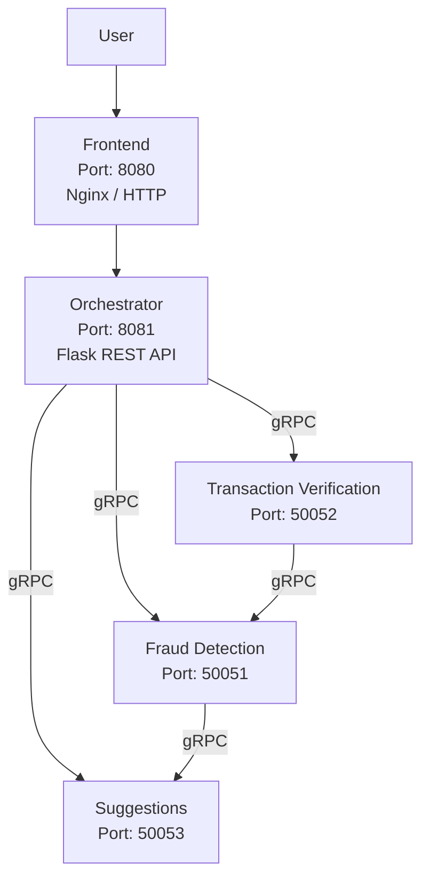
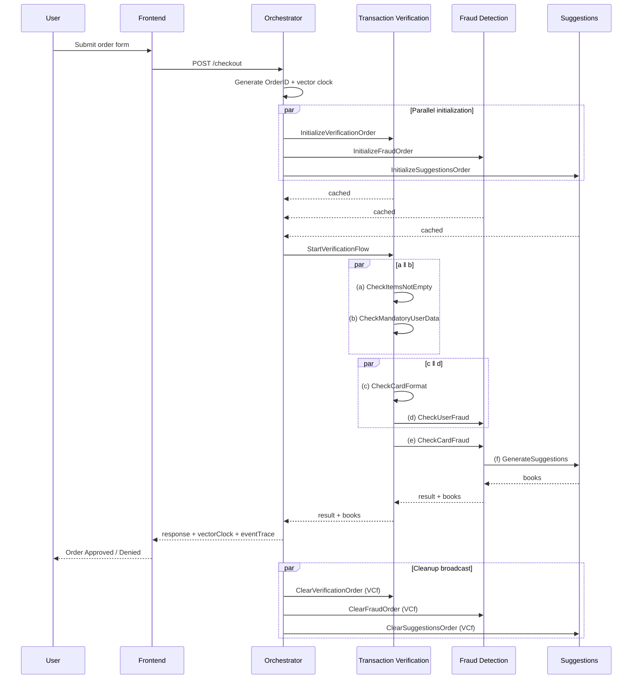

# Distributed Bookstore System

Distributed Systems course project @ University of Tartu — an online bookstore checkout system built with a microservices architecture.

The frontend sends checkout requests to an orchestrator, which coordinates transaction verification, fraud detection, and book suggestions via gRPC.

## Architecture



All backend services run in Docker containers. The orchestrator dispatches parallel init RPCs to all three services, then triggers the execution flow via `StartVerificationFlow` on transaction verification. Backend services communicate directly over gRPC: TV calls FD for fraud checks, FD calls Suggestions for book recommendations. After the terminal result, the orchestrator broadcasts `ClearOrder` to all services.

## Services

| Service | Port | Protocol | Description |
|---------|------|----------|-------------|
| **Frontend** | 8080 | HTTP (Nginx) | Static HTML/JS checkout form served by Nginx |
| **Orchestrator** | 8081 | REST (Flask) | Receives checkout requests, coordinates gRPC calls |
| **Transaction Verification** | 50052 | gRPC | Validates items, user data, and card format |
| **Fraud Detection** | 50051 | gRPC | Deterministic fraud analysis on user data and card data |
| **Suggestions** | 50053 | gRPC | AI-generated book recommendations (Google Gemma 3 27B) with deterministic fallback |

## Checkout Flow

The checkout uses a two-stage protocol with vector clocks tracking causal order across services.

**Stage 1 — Initialization:** The orchestrator generates a unique `OrderID` and dispatches three parallel init RPCs with the same parent vector clock. Each service caches the order payload and returns immediately.

**Stage 2 — Execution:** The orchestrator calls `StartVerificationFlow` on TV, which runs this 6-event partial order:

```
         ┌── (a) check items ──── (c) check card format ───┐
  init ──┤                                                  ├── (e) check card fraud ── (f) suggestions
         └── (b) check user data ── (d) check user fraud ──┘
```

- **a ‖ b** — run in parallel within TV
- **c** depends on **a**; **d** depends on **b** — **c ‖ d** is the main cross-service concurrency
- **e** depends on both **c** and **d** (clocks merged at join point)
- **f** depends on **e**

Any failure short-circuits downstream events. Suggestions failure is non-fatal (order approved with empty book list). After the terminal result, the orchestrator broadcasts `ClearOrder` with the final vector clock `VCf` — services clear cached data only if their local clock `<= VCf`.

## System Diagram



## Validation Rules

| Field | Rule |
|-------|------|
| Name | Required (non-empty) |
| Email | Must match `[^@]+@[^@]+\.[^@]+` |
| Card number | Exactly 16 digits |
| CVV | 3 or 4 digits |
| Expiration date | Format `MM/YY`, must not be expired |
| Billing street | At least 5 characters |
| Billing city | At least 2 characters |
| Billing state | Alphabetic characters only |
| Billing ZIP | Exactly 5 digits |
| Billing country | At least 2 characters |

## Fraud Detection Rules

Fraud detection uses deterministic rules:

- Card `4111111111111111` always passes (test card)
- Cards starting with `999` are flagged as fraudulent
- Order amounts exceeding 1000 trigger fraud detection
- User names or emails containing "fraud" are flagged

## How to Run

### Setting up Google AI API Key

The suggestions service uses Google Gemma 3 27B for AI-generated book recommendations. You need a Google AI API key from [Google AI Studio](https://aistudio.google.com/apikey).

**Option 1: Export in terminal**
```bash
export GOOGLE_API_KEY=your_actual_api_key_here
docker compose up --build
```

**Option 2: Use a .env file**
Create a `.env` file in the project root:
```
GOOGLE_API_KEY=your_actual_api_key_here
```

If no API key is provided, suggestions fall back to a static book list.

### Running the Application

```bash
docker compose up --build
```

The frontend will be available at [http://localhost:8080](http://localhost:8080).

Code changes are hot-reloaded automatically — no restart needed during development.

## Project Structure

```
frontend/                     Static HTML/JS checkout page (served by Nginx)
orchestrator/                 Flask REST API — coordinates the checkout pipeline
transaction_verification/     gRPC service — field validation (events a, b, c)
fraud_detection/              gRPC service — fraud checks (events d, e)
suggestions/                  gRPC service — AI book recommendations (event f)
utils/                        Shared protobuf definitions and vector clock helpers
docs/                         Documentation and project plans
```

## Known Limitations

- Item list is hardcoded in the frontend (two books)
- Only 5-digit ZIP codes are supported for billing address
- Order amount is based on item quantity sum, not actual prices
- AI suggestions may not always parse correctly (falls back to static list)
