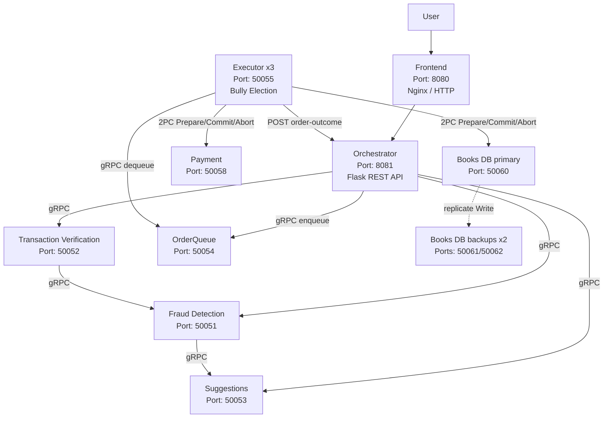
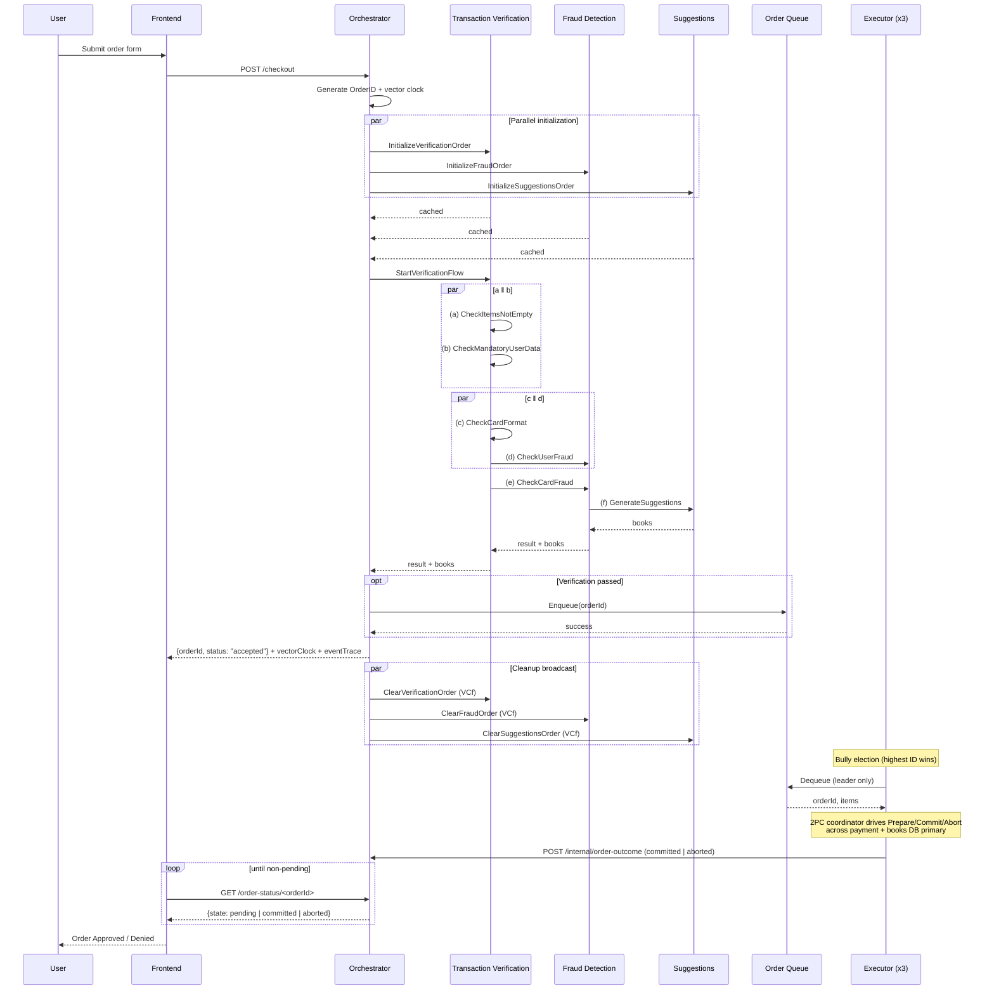
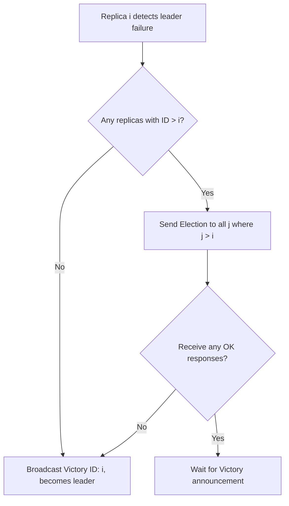
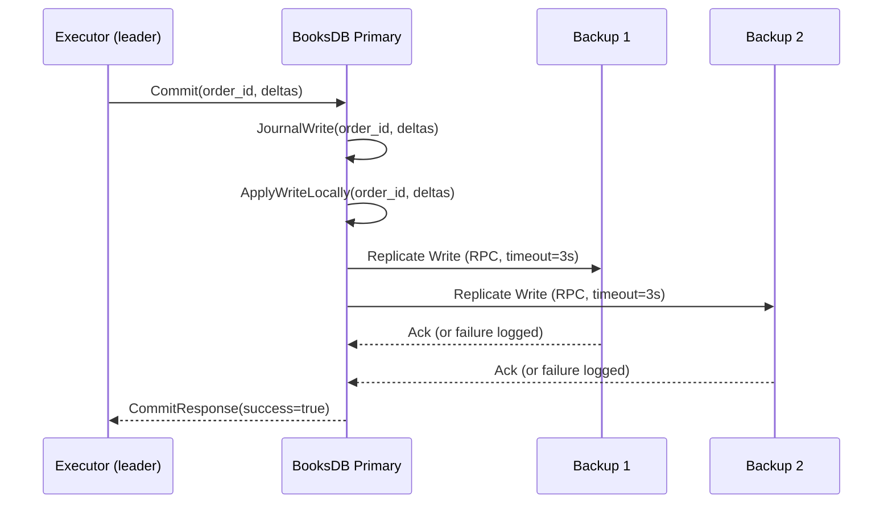
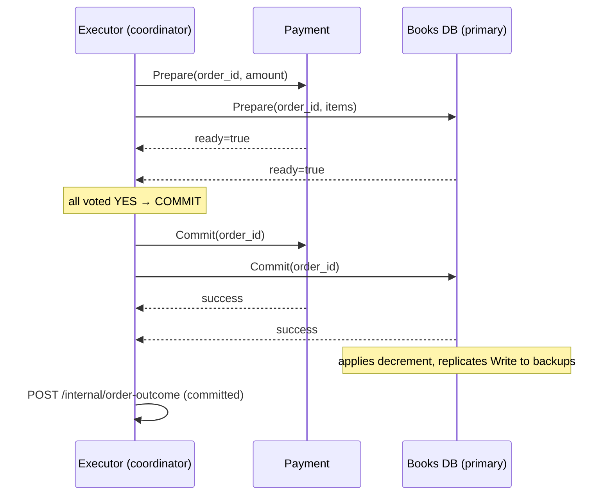

# Distributed Bookstore System

Distributed Systems course project @ University of Tartu — an online bookstore checkout system built with a microservices architecture.

The frontend sends checkout requests to an orchestrator, which coordinates transaction verification, fraud detection, and book suggestions via gRPC. Verified orders are enqueued and then driven through a **two-phase commit (2PC)** protocol by the elected executor leader, which acts as the coordinator across a dummy payment service and the replicated books database — only the `Commit` phase executes the real side-effects (charge + stock decrement).

## System Model

The following is a system model description using the concepts described in the lecture.

- Communication
    - Frontend → Orchestrator: HTTP POST `/checkout`.
    - Orchestrator → backend services (TV, FD, S, OQ): gRPC protocol.
    - Orchestrator sends parallel initialization RPCs and uses gRPC metadata to carry vector clocks and event traces; services return vector clock and trace in metadata.
    - RPC calls are wrapped in try/except and use explicit timeouts in some places (e.g., enqueue), so the implementation treats RPCs as possibly failing.

- Architecture
    - Components: Frontend, Orchestrator, Transaction Verification (TV), Fraud Detection (FD), Suggestions (S), Order Queue (OQ), Executor replicas (EX).
    - Responsibilities:
        - Orchestrator: coordinates the pipeline, generates `OrderID`, merges clocks, enqueues approved orders.
        - TV: caches per-order data, runs the verification flow and calls FD when needed.
        - FD: runs fraud checks and calls S; suggestions are optional and handled as non-fatal on failure.
        - S: generates suggestions via GenAI when available; falls back to a static list on error.
        - OQ: an in-memory FIFO queue implemented with a `deque`.
        - EX: replicas use a bully-style election; the elected leader polls OQ and performs dequeues.

- Timing
    - The code uses time-based mechanisms: RPC timeouts, election/heartbeat intervals, dequeue interval.
    - Vector clocks are used to record causal order and to determine safe cleanup. Clear handlers remove cached data when the local clock is less or equal than the final clock.

- Failures
    - The implementation handles RPC exceptions and return errors; suggestions failure is explicitly non-fatal.
    - Executor election tolerates unreachable peers and re-elects a leader when needed.


## Architecture



All backend services run in Docker containers. The orchestrator dispatches parallel init RPCs to all three verification services, then triggers the execution flow via `StartVerificationFlow` on transaction verification. Backend services communicate directly over gRPC: TV calls FD for fraud checks, FD calls Suggestions for book recommendations. Once verification completes, the orchestrator enqueues the order into OrderQueue, responds `accepted` to the frontend, and broadcasts `ClearOrder`. The elected executor leader then dequeues the order and drives a 2PC across the payment service and the books database primary — only a successful Commit charges the customer and decrements stock. The executor posts the final outcome back to the orchestrator; the frontend polls `/order-status/<orderId>` until it flips to `committed` or `aborted`.

## Services

| Service | Port | Protocol | Description |
|---------|------|----------|-------------|
| **Frontend** | 8080 | HTTP (Nginx) | Static HTML/JS checkout form served by Nginx |
| **Orchestrator** | 8081 | REST (Flask) | Receives checkout requests, coordinates gRPC calls |
| **Transaction Verification** | 50052 | gRPC | Validates items, user data, and card format |
| **Fraud Detection** | 50051 | gRPC | Deterministic fraud analysis on user data and card data |
| **Suggestions** | 50053 | gRPC | AI-generated book recommendations (Google Gemma 3 27B) with deterministic fallback |
| **Order Queue** | 50054 | gRPC | Thread-safe FIFO queue for approved orders |
| **Executor** (x3) | 50055 | gRPC | Replicated order executor with bully-algorithm leader election; leader is the 2PC coordinator |
| **Payment** | 50058 | gRPC | Dummy payment service — 2PC participant; real charge only on Commit |
| **Books Database** (x3) | 50060 | gRPC | Replicated stock store (primary + 2 backups); 2PC participant — stock decrement only on Commit |

## Checkout Flow

The checkout uses a two-stage protocol with vector clocks tracking causal order across services.

**Stage 1 — Initialization:** The orchestrator generates a unique `OrderID` and dispatches three parallel init RPCs with the same parent vector clock. Each service caches the order payload and returns immediately.

**Stage 2 — Execution:** The orchestrator calls `StartVerificationFlow` on TV, which runs this 6-event partial order:

```
         ┌── (a) check items ──── (c) check card format ───┐
  init ──┤                                                  ├── (e) check card fraud ── (f) suggestions
         └── (b) check user data ── (d) check user fraud ──┘
```

- **a ‖ b** — run in parallel within TV
- **c** depends on **a**; **d** depends on **b** — **c ‖ d** is the main cross-service concurrency
- **e** depends on both **c** and **d** (clocks merged at join point)
- **f** depends on **e**

Any failure short-circuits downstream events. Suggestions failure is non-fatal (order approved with empty book list). After the terminal result, the orchestrator broadcasts `ClearOrder` with the final vector clock `VCf` — services clear cached data only if their local clock `<= VCf`.

**Stage 3 — Distributed Commit (2PC):** Verified orders are enqueued into the OrderQueue and `/checkout` returns `{orderId, status: "accepted"}` — verification passed, but the order has not yet been committed. Three Executor replicas use the bully algorithm to elect a leader; the leader dequeues the order and acts as the 2PC coordinator across two participants: the payment service and the books database primary. Phase 1 (Prepare) collects votes; any NO or RPC failure becomes an Abort. Phase 2 (Commit or Abort) broadcasts the decision with bounded retry. Only a successful Commit triggers the real side-effects — the payment service logs `EXECUTED payment…`, and the books database applies the staged stock decrement and replicates it to the backups. After the decision, the executor posts the outcome to the orchestrator's `/internal/order-outcome` endpoint. The frontend polls `/order-status/<orderId>` every ~1.5 s until it sees `committed` or `aborted` (with a ~30 s timeout fallback).

## System Diagram



## Leader Election (Bully Algorithm)

The bully algorithm scales to any number of replicas (N). Each replica has a unique numeric ID; the highest-alive ID acts as the leader. When a replica `i` detects the leader is down it:

- Sends an `Election` message to all replicas with ID > `i`.
- If no higher-ID replica responds, `i` broadcasts `Victory` and becomes the leader.
- If any higher-ID replies with `OK`, `i` stops and waits for a `Victory` announcement from the higher-ID winner.



## Consistency Protocol (Books DB)
This section documents the behavior implemented in `books_database/src/app.py` (very short + diagram).

Very short: Primary journals and applies committed writes locally, then performs synchronous RPC replication attempts to configured backups; replication failures are logged and do not cause the Primary to roll back (best‑effort replication).



Short facts (implemented):
- `Prepare` and `Commit` entries are persisted to a journal when `BOOKS_DB_JOURNAL` is set; the journal is replayed on startup.
- On `Commit` the Primary applies the decrement and persists the journal before replication.
- Primary replication uses synchronous RPC calls to each backup (3s timeout) but does not enforce quorum or fail the commit on backup failures; failures are logged. The Primary returns success to the caller (`CommitResponse(success=true)`).
- Backups apply writes idempotently and can replay the journal on restart.

This description reflects current code (no stronger durability guarantees are assumed).


## Distributed Commitment (2PC)

The elected executor leader is the 2PC coordinator. Participants are the dummy **payment** service and the **books database** primary. Stock enforcement and the payment side-effect are intentionally *not* performed on the synchronous checkout path — they happen inside the commit phase of this protocol so that the two side-effects are applied atomically.



A `NO` vote (e.g. insufficient stock) or any RPC exception on Prepare short-circuits to Abort; both participants then drop their staged state and no side-effect is applied. `Commit` and `Abort` are broadcast with bounded retry (3× with short backoff) to ride out transient network blips — participants' idempotent handling (three-state `_tx` map keyed by `order_id`) keeps repeated messages safe.

**Message count and trade-offs (for the report):**

| Dimension              | 2PC (chosen)                       | 3PC                                 |
|------------------------|------------------------------------|-------------------------------------|
| Phases                 | 2                                  | 3                                   |
| Messages per tx (N=2)  | 8                                  | 12                                  |
| Blocking on coord fail | Yes, between Prepare and decision  | No (with synchrony + no partitions) |
| Complexity             | Low                                | Medium                              |

**Participant recovery (bonus):** the books database optionally journals its `_tx` map to `$BOOKS_DB_JOURNAL` (default `/tmp/books_db_journal.json` in compose) before returning a `Prepare` vote, so after a crash a re-sent `Commit` applies the decrement exactly once.

**Coordinator failure:** 2PC blocks in the window between votes being collected and the decision being broadcast — a surviving participant cannot safely decide unilaterally. A full write-up of the failure windows, why they're inherent to 2PC, and the proposed mitigation (replicated decision log on the bully-elected standby executor, plus a termination protocol) lives in [docs/analysis/coordinator-failure.md](docs/analysis/coordinator-failure.md).

## Validation Rules

| Field | Rule |
|-------|------|
| Name | Required (non-empty) |
| Email | Must match `[^@]+@[^@]+\.[^@]+` |
| Card number | Exactly 16 digits |
| CVV | 3 or 4 digits |
| Expiration date | Format `MM/YY`, must not be expired |
| Billing street | At least 5 characters |
| Billing city | At least 2 characters |
| Billing state | Alphabetic characters only |
| Billing ZIP | Exactly 5 digits |
| Billing country | At least 2 characters |

## Fraud Detection Rules

Fraud detection uses deterministic rules:

- Card `4111111111111111` always passes (test card)
- Cards starting with `999` are flagged as fraudulent
- Order amounts exceeding 1000 trigger fraud detection
- User names or emails containing "fraud" are flagged

## How to Run

### Setting up Google AI API Key

The suggestions service uses Google Gemma 3 27B for AI-generated book recommendations. You need a Google AI API key from [Google AI Studio](https://aistudio.google.com/apikey).

**Option 1: Export in terminal**
```bash
export GOOGLE_API_KEY=your_actual_api_key_here
docker compose up --build
```

**Option 2: Use a .env file**
Create a `.env` file in the project root:
```
GOOGLE_API_KEY=your_actual_api_key_here
```

If no API key is provided, suggestions fall back to a static book list.

### Running the Application

```bash
docker compose up --build
```

The frontend will be available at [http://localhost:8080](http://localhost:8080).
The orchestrator API is available at [http://localhost:8081](http://localhost:8081).
Grafana is available at [http://localhost:3000](http://localhost:3000) with the default `admin` / `admin` login.

Code changes are hot-reloaded automatically — no restart needed during development.

### E2E Testing and Observability

The stack includes `grafana/otel-lgtm` for local OpenTelemetry metrics and traces. Prometheus is used for metrics and Tempo for traces inside Grafana.

To run the app with the Locust web UI:

```bash
docker compose --profile e2e up --build
```

Open:

- Frontend: [http://localhost:8080](http://localhost:8080)
- Grafana: [http://localhost:3000](http://localhost:3000)
- Locust: [http://localhost:8089](http://localhost:8089)

The main dashboard JSON lives at [docs/grafana_dashboard.json](docs/grafana_dashboard.json). Import it from Grafana's **Dashboards > New > Import** screen if it is not already present.

Run a headless smoke scenario:

```bash
LOCUST_SCENARIO=single_non_fraudulent_order LOCUST_RUN_ID=single-smoke \
  locust -f tests/locust/e2e.py \
  --host http://localhost:8081 \
  --headless \
  --users 1 \
  --spawn-rate 1 \
  --run-time 30s \
  --csv tests/locust/results/single_non_fraudulent_order \
  --html tests/locust/results/single_non_fraudulent_order.html
```

Use the low-stock E2E override for same-book conflict testing:

```bash
LOCUST_SCENARIO=same_book_conflict_low_stock LOCUST_RUN_ID=conflict-local \
  docker compose -f docker-compose.yaml -f docker-compose.e2e.yaml --profile e2e up --build
```

See [docs/evaluation/e2e-observability.md](docs/evaluation/e2e-observability.md) and [tests/locust/README.md](tests/locust/README.md) for the full scenario matrix and dashboard interpretation guide. The implementation lesson is captured in [docs/solutions/integration-issues/e2e-observability-locust-grafana.md](docs/solutions/integration-issues/e2e-observability-locust-grafana.md).

## Project Structure

```
frontend/                     Static HTML/JS checkout page (served by Nginx)
orchestrator/                 Flask REST API — coordinates the checkout pipeline, exposes /order-status
transaction_verification/     gRPC service — field validation (events a, b, c)
fraud_detection/              gRPC service — fraud checks (events d, e)
suggestions/                  gRPC service — AI book recommendations (event f)
order_queue/                  gRPC service — thread-safe FIFO queue for verified orders
executor/                     gRPC service — replicated; leader drives 2PC as coordinator
payment/                      gRPC service — dummy payment; 2PC participant
books_database/               gRPC service — replicated stock store; 2PC participant
utils/                        Shared protobuf definitions and vector clock helpers
docs/                         Documentation, project plans, and analysis notes
```

## Known Limitations

- Item list is hardcoded in the frontend (two books)
- Only 5-digit ZIP codes are supported for billing address
- Order amount is based on item quantity sum, not actual prices
- AI suggestions may not always parse correctly (falls back to static list)
- **2PC coordinator blocking window** — if the executor leader crashes between collecting votes and broadcasting the decision, the participants that voted YES remain staged until a coordinator returns. The prototype does not implement coordinator-side decision replication; see [docs/analysis/coordinator-failure.md](docs/analysis/coordinator-failure.md) for the mitigation design.
- **Books DB commit replication** is best-effort per-title via absolute `Write(title, new_stock)` values, outside the primary's lock. A multi-title commit that crashes mid-replication can leave divergent backups with no automatic reconciliation — acceptable because only one executor leader drives 2PC at a time.
- **Order status map** is in-memory and single-instance. Orchestrator restart loses outcome records for orders submitted before the restart; frontend polling will time out with the "still processing" fallback.
