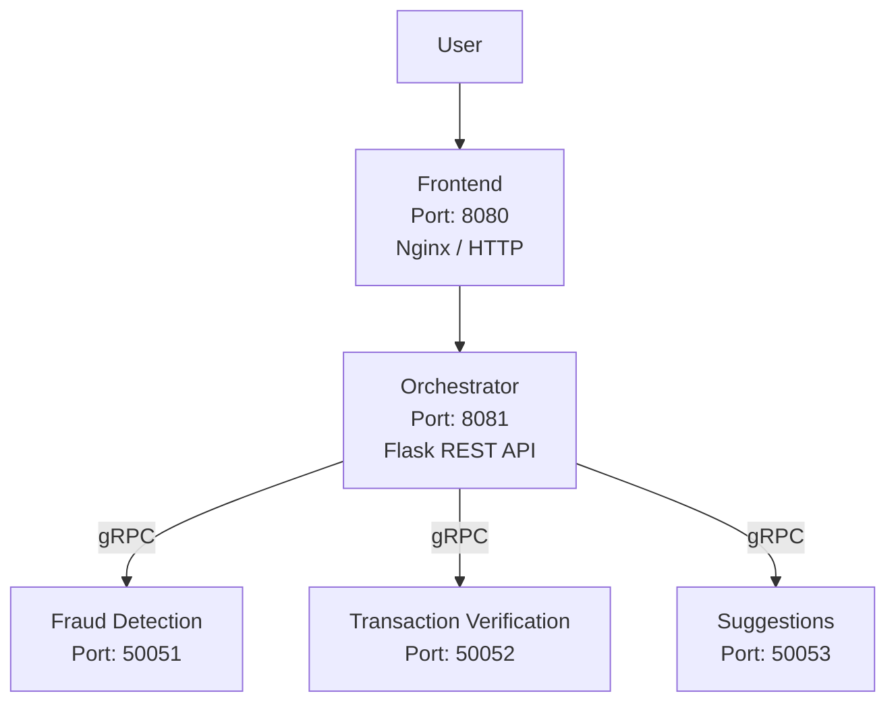
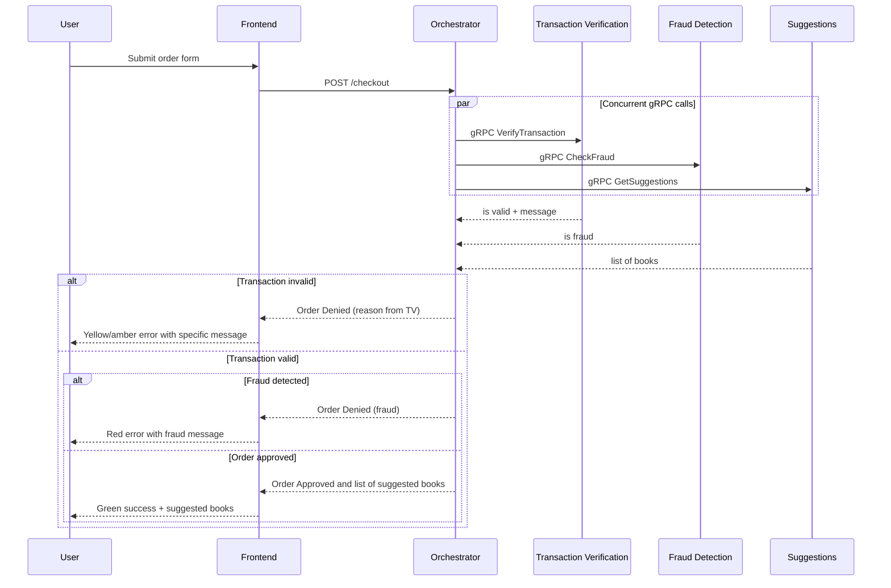

# Distributed Bookstore System

Distributed Systems course project @ University of Tartu — an online bookstore checkout system built with a microservices architecture.

The frontend sends checkout requests to an orchestrator, which coordinates transaction verification, fraud detection, and book suggestions via gRPC.

## Architecture



All backend services run in Docker containers. The orchestrator calls the three gRPC services **concurrently** using threading. Transaction verification is checked first; if invalid, the order is denied without fraud check results. Suggestions are fetched concurrently but only included in the response if the transaction is valid.

## Services

| Service | Port | Protocol | Description |
|---------|------|----------|-------------|
| **Frontend** | 8080 | HTTP (Nginx) | Static HTML/JS checkout form served by Nginx |
| **Orchestrator** | 8081 | REST (Flask) | Receives checkout requests, coordinates gRPC calls |
| **Fraud Detection** | 50051 | gRPC | Flags orders with amount > 1000 or card prefix "999" |
| **Transaction Verification** | 50052 | gRPC | Validates email, card number, CVV, expiration date, and billing address |
| **Suggestions** | 50053 | gRPC | Returns a static list of recommended books |

## System diagram



## Validation Rules (Transaction Verification)

| Field | Rule |
|-------|------|
| Email | Must match `[^@]+@[^@]+\.[^@]+` |
| Card number | Exactly 16 digits |
| CVV | 3 or 4 digits |
| Expiration date | Format `MM/YY`, must not be expired (year/month comparison) |
| Billing street | At least 5 characters |
| Billing city | At least 2 characters |
| Billing state | Alphabetic characters only |
| Billing ZIP | Exactly 5 digits |
| Billing country | At least 2 characters |

## Fraud Detection Rules

| Rule | Trigger |
|------|---------|
| High amount | `order_amount > 1000` (based on total item quantity) |
| Suspicious card | Card number starts with `"999"` |

## How to Run

```bash
docker compose up --build
```

The frontend will be available at [http://localhost:8080](http://localhost:8080).

Services are configured in `docker-compose.yaml`. Code changes are hot-reloaded automatically — no restart needed during development.

### Running locally (alternative)

- Python 3.8+, pip, [grpcio-tools](https://grpc.io/docs/languages/python/quickstart/)
- Install each service's `requirements.txt`
- Frontend: open `frontend/src/index.html` in a browser

## Project Structure

```
frontend/          Static HTML/JS checkout page (served by Nginx)
orchestrator/      Flask REST API — coordinates the checkout pipeline
fraud_detection/   gRPC service — fraud rule checks
transaction_verification/  gRPC service — field validation
suggestions/       gRPC service — book recommendations
utils/             Shared protobuf definitions and helper scripts
docs/              Documentation and project plans
```

## Known Limitations

- Suggestions are static and do not depend on the items in the cart
- Order amount for fraud detection is based on item quantity sum, not actual prices
- Item list is hardcoded in the frontend (Book A, Book B)
- Only US ZIP codes (5 digits) are supported for billing address
- The orchestrator assigns a static order ID ("12345")
