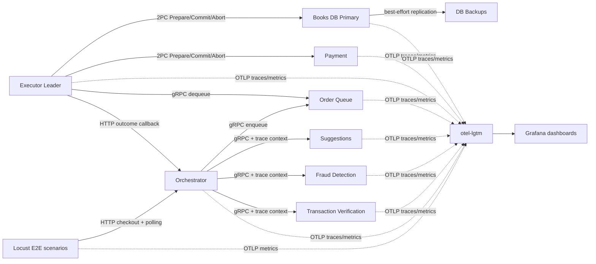

# End-to-End Observability Evaluation

## Overview

Upgrade the current Locust and Grafana setup from a basic load generator plus partial service dashboard into a repeatable end-to-end evaluation system for the distributed bookstore.

The target state is:

- Locust drives realistic checkout journeys and records the full lifecycle from `POST /checkout` through final `committed`, `aborted`, or timeout state.
- Grafana shows where orders spend time, where failures occur, and how each service behaves under happy-path, degraded, abort, and overload scenarios.
- Traces, metrics, and test reports can be correlated by scenario, run id, and order id without exposing card or user data.
- A developer can start the stack, open Grafana and Locust, run a scenario, and explain performance/failure behavior from the dashboard rather than container logs alone.

Implementation status: completed in branch `e2e-improvements`. Static validation passed for Python compilation, Grafana dashboard JSON, and Docker Compose configuration. Live Docker/Grafana/Locust verification remains a follow-up because the Docker daemon was unavailable in this environment.

## Problem Statement

The repository already has the beginning of observability:

- `docker-compose.yaml` runs `grafana/otel-lgtm` on ports `3000`, `4317`, and `4318`.
- `orchestrator/src/app.py` emits OpenTelemetry metrics/traces for `/checkout`.
- `books_database/src/app.py` emits OpenTelemetry metrics/traces for the primary DB path.
- `docs/grafana_dashboard.json` contains a dashboard for checkout counts, checkout p95, active/pending orders, DB operations, stock levels, staged transactions, and orchestrator traces.
- `tests/locust/scenario2.py` drives non-conflicting orders and polls `/order-status/<order_id>`.

Those pieces are useful, but they do not yet provide full end-to-end evaluation:

- Grafana is not a test runner. It visualizes signals; Locust must define success/failure and generate load.
- Current checkout duration measures the synchronous orchestrator path until an order is accepted/enqueued, not the full order lifecycle through 2PC completion.
- The current Locust polling loop can exit on timeout without marking the order as a failed Locust transaction.
- Most services are not instrumented: transaction verification, fraud detection, suggestions, order queue, executor, payment, and DB backups do not currently expose service-level metrics/traces.
- There is no direct Locust-to-Grafana signal, so dashboards cannot show the active test run, scenario outcomes, or true E2E latency from Locust's perspective.
- The Grafana dashboard appears to require manual import; there is no repo-level provisioning or runbook for opening and interpreting it.

## Research Summary

### Local Research

- `README.md` documents the actual end-to-end flow: frontend -> orchestrator -> verification/fraud/suggestions -> order queue -> executor leader -> payment and books DB via 2PC -> orchestrator outcome callback -> frontend polling.
- `tests/locust/scenario2.py` already models the important user behavior: submit checkout, then poll `/order-status/<order_id>` until `committed` or `aborted`.
- `orchestrator/src/app.py` has a good first telemetry pattern: OTLP HTTP exporters, a `checkout` span, request counters, checkout duration histogram, active order counter, denied order counter, and a pending orders observable gauge.
- `books_database/src/app.py` similarly has OTLP exporters, DB operation counters, operation duration histogram, staged transaction counter, and stock observable gauge.
- `executor/src/app.py` is the most important missing visibility point. It owns queue consumption, election behavior, 2PC prepare/finalize phases, retries, final outcome, and notification back to the orchestrator.
- `payment/src/app.py` already supports `PAYMENT_VOTE_NO=1`, which is a useful deterministic abort scenario for E2E evaluation.
- `docs/solutions/` does not exist in this repo, so there are no institutional learnings or critical patterns to carry forward.

### External Research

- Locust supports manual request success/failure via `catch_response=True`; this is the right mechanism for validating response bodies and terminal order states, not just HTTP status codes.
- Locust can fire custom request events, which can be used to record a synthetic `E2E` request such as `checkout_to_committed` with the full lifecycle duration.
- Locust headless mode supports CSV and HTML reports, which should be part of repeatable evaluation artifacts.
- `grafana/otel-lgtm` is intended for development, demo, and testing environments. It bundles Grafana, an OpenTelemetry Collector, Prometheus, Tempo, Loki, and Pyroscope, and exposes OTLP gRPC on `4317`, OTLP HTTP on `4318`, and Grafana on `3000`.
- OpenTelemetry Python supports OTLP exporters for traces and metrics, and propagation APIs for injecting/extracting trace context across service boundaries. This matters because order-level traces should cross HTTP and gRPC hops, not stop at the orchestrator.

## Proposed Solution

Build an "E2E evaluation loop" made of four coordinated upgrades:

1. **Shared observability foundation**
   - Standardize OpenTelemetry setup across Python services.
   - Add consistent resource attributes, service names, low-cardinality labels, and order/test-run trace attributes.
   - Propagate trace context through HTTP and gRPC metadata alongside the existing vector clock metadata.

2. **Service-level telemetry coverage**
   - Instrument every service involved in checkout and 2PC.
   - Add spans and metrics around the actual boundaries where time and failures happen: init, validation, fraud, suggestions, enqueue, queue wait, dequeue, election, prepare, commit/abort, retries, replication, and outcome notification.

3. **Locust as the E2E truth source**
   - Refactor Locust scenarios so they record terminal order outcomes and full lifecycle latency.
   - Add deterministic success, denial, abort, overload, and degraded-service scenarios.
   - Export Locust run metrics to Grafana through OTLP and persist CSV/HTML reports for offline comparison.

4. **Grafana dashboards and runbooks**
   - Provision dashboards automatically where practical.
   - Replace the current partial dashboard with an E2E evaluation dashboard set.
   - Document how to open Grafana, open Locust, run scenarios, and interpret the panels.

## Technical Approach

### Architecture



### Core Concepts

- **Run id**: A low-cardinality identifier for one Locust run, for example `2026-05-20T120000-scenario2`. Use as a metric label only when bounded to one active run.
- **Scenario name**: A low-cardinality label such as `happy_non_conflicting`, `payment_abort`, or `executor_backlog`.
- **Order id**: Use as a trace attribute and log field, not as a metric label, to avoid high-cardinality metrics.
- **Outcome**: `committed`, `aborted`, `denied`, `timeout`, `unknown`, or `error`.
- **E2E duration**: Time from Locust starting `POST /checkout` until terminal state or timeout.
- **Server lifecycle duration**: Time from orchestrator receiving `/checkout` until executor callback records final outcome. This complements Locust's client-observed E2E duration.
- **Frontend single-order demo**: A checkpoint-friendly manual path through `http://localhost:8080` that creates one valid order, waits for final UI approval, then uses logs, traces, and metrics to show the full execution flow.

## Implementation Phases

### Phase 1: Observability Foundation

Add a shared helper and consistent configuration so each service emits comparable telemetry.

Planned files:

- `utils/observability.py`
- `orchestrator/src/app.py`
- `transaction_verification/src/app.py`
- `fraud_detection/src/app.py`
- `suggestions/src/app.py`
- `order_queue/src/app.py`
- `executor/src/app.py`
- `payment/src/app.py`
- `books_database/src/app.py`
- `*/requirements.txt`
- `docker-compose.yaml`

Tasks:

- [x] Create `utils/observability.py` with `configure_otel(service_name)`, `get_tracer()`, `get_meter()`, and helpers for safe attributes.
- [x] Configure all services with `OTEL_EXPORTER_OTLP_ENDPOINT=http://observability:4318` and a unique `OTEL_SERVICE_NAME`.
- [x] Ensure exporter failures do not crash service startup when the observability container is unavailable.
- [x] Add a trace context propagation helper for gRPC metadata.
- [x] Propagate `traceparent`/`tracestate` through orchestrator gRPC calls and executor participant calls.
- [x] Preserve existing vector clock metadata and keep it separate from OpenTelemetry trace context.
- [x] Add a `test.run_id` attribute when supplied by Locust through an HTTP header such as `X-Test-Run-Id`.
- [x] Add a `scenario.name` attribute when supplied by Locust through an HTTP header such as `X-Scenario-Name`.
- [x] Confirm no user name, email, billing address, full card number, or CVV is emitted as metric labels, trace attributes, or log fields.

Pseudo-interface:

```python
# utils/observability.py
def configure_otel(service_name: str):
    """Configure trace and metric providers for one service."""

def inject_trace_metadata(metadata: tuple[tuple[str, str], ...]) -> tuple[tuple[str, str], ...]:
    """Append trace context keys to outgoing gRPC metadata."""

def extract_trace_context(metadata) -> object:
    """Extract trace context from incoming gRPC metadata."""
```

### Phase 2: Application Metrics and Traces

Instrument the service boundaries that explain performance and failure.

#### Orchestrator

Planned file: `orchestrator/src/app.py`

- [x] Keep the existing `checkout_duration_seconds`, but rename or document it as synchronous checkout duration.
- [x] Add `order_server_lifecycle_duration_seconds` from initial `/checkout` receipt to `/internal/order-outcome`.
- [x] Store `created_at`, `accepted_at`, `outcome_at`, `run_id`, and `scenario` in `order_statuses`.
- [x] Add `order_terminal_total{outcome, scenario}`.
- [x] Add `checkout_stage_duration_seconds{stage, status}` for init, verification flow, enqueue, clear broadcast, and response creation.
- [x] Add spans for each external call: `init.transaction_verification`, `init.fraud_detection`, `init.suggestions`, `verification.start_flow`, `order_queue.enqueue`, and `clear.*`.
- [x] Add trace attributes `order.id`, `scenario.name`, `test.run_id`, and `checkout.status`.

#### Transaction Verification, Fraud Detection, Suggestions

Planned files:

- `transaction_verification/src/app.py`
- `fraud_detection/src/app.py`
- `suggestions/src/app.py`

- [x] Add server spans for each gRPC handler.
- [x] Add child spans for validation stages `a` through `f` so traces match the documented partial order.
- [x] Add counters for validation pass/fail, fraud pass/fail, suggestions success/fallback/error.
- [x] Add duration histograms per handler and per logical stage.
- [x] Keep error labels bounded to stable reason codes such as `missing_user_data`, `invalid_card`, `fraud_rule`, `suggestions_fallback`, and `grpc_error`.

#### Order Queue

Planned file: `order_queue/src/app.py`

- [x] Add `order_queue_depth` observable gauge.
- [x] Add `order_queue_operations_total{operation, result}` for enqueue/dequeue empty/dequeue found.
- [x] Add `order_queue_wait_seconds` measured from enqueue timestamp to dequeue.
- [x] Include `order.id` in spans for enqueue and dequeue.

#### Executor

Planned file: `executor/src/app.py`

- [x] Add spans for `executor.election`, `executor.dequeue`, `executor.execute_order`, `2pc.prepare`, `2pc.finalize`, and `orchestrator.notify_outcome`.
- [x] Add `executor_leader_id` observable gauge or up/down state metric per executor.
- [x] Add `executor_elections_total{result}` and `executor_leader_changes_total`.
- [x] Add `executor_dequeue_total{result}` and `executor_order_duration_seconds{outcome}`.
- [x] Add `two_pc_phase_duration_seconds{phase, participant, outcome}`.
- [x] Add `two_pc_votes_total{participant, vote}`.
- [x] Add `two_pc_finalize_retries_total{participant, verb}` and `two_pc_finalize_failures_total{participant, verb}`.
- [x] Add `orchestrator_outcome_notify_total{result}`.
- [x] Tag all spans with `executor.id`, `leader.id`, and `order.id`.

#### Payment

Planned file: `payment/src/app.py`

- [x] Add spans for `payment.prepare`, `payment.commit`, and `payment.abort`.
- [x] Add `payment_operations_total{operation, result}`.
- [x] Add `payment_operation_duration_seconds{operation, result}`.
- [x] Add `payment_staged_transactions` observable gauge.
- [x] Expose forced-NO behavior as a metric label `result="forced_no"` when `PAYMENT_VOTE_NO=1`.

#### Books Database

Planned file: `books_database/src/app.py`

- [x] Keep existing `db_operations_total`, `db_operation_duration_seconds`, `staged_transactions`, and `book_stock_level`.
- [x] Add DB operation duration panels to Grafana; the histogram exists but is not visualized in the current dashboard.
- [x] Add replication metrics: `db_replication_attempts_total{backup, result}` and `db_replication_duration_seconds{backup, result}`.
- [x] Consider adding OTLP configuration to backup replicas as well, or document why only the primary is expected to emit metrics.
- [x] Ensure backup stock gauges are either emitted and dashboarded, or intentionally excluded to keep scope clear.
- [x] Add a test-only initial stock override, preferably `BOOKS_DB_INITIAL_STOCK_JSON`, so E2E runs can start the primary with low stock for conflict scenarios without adding production reset APIs.
- [x] Add a `docker-compose.e2e.yaml` or documented Compose profile that sets `BOOKS_DB_INITIAL_STOCK_JSON='{"Distributed systems.": 1, "Introduction to gRPC.": 5000}'` for same-book conflict tests.

#### OpenTelemetry Instrument Coverage Checklist

The assignment asks for at least two meaningful examples of each instrument type. The implementation should explicitly satisfy this list and call it out in the documentation.

| Instrument type | Required examples |
| --- | --- |
| Span | `checkout` on orchestrator; `2pc.prepare`/`2pc.finalize` on executor; `payment.commit`; `db.commit` |
| Counter | `requests_counter_total{status}`; `order_terminal_total{outcome}`; `two_pc_votes_total{participant,vote}`; `payment_operations_total{operation,result}` |
| UpDownCounter | `active_orders`; `staged_transactions`; optional `executor_active_orders` while an executor is processing one order |
| Histogram | `checkout_duration_seconds`; `order_server_lifecycle_duration_seconds`; `order_queue_wait_seconds`; `two_pc_phase_duration_seconds{phase,participant,outcome}` |
| Asynchronous Gauge | `pending_orders_gauge`; `order_queue_depth`; `book_stock_level`; optional `payment_staged_transactions` |

Acceptance for this phase requires at least two implemented and dashboarded examples per row.

### Phase 3: Locust E2E Scenarios

Refactor Locust from one scenario file into a small evaluation suite.

Planned files:

- `tests/locust/e2e.py`
- `tests/locust/common.py`
- `tests/locust/payloads.py`
- `tests/locust/README.md`
- `tests/locust/requirements.txt`
- `docker-compose.yaml`
- `docker-compose.e2e.yaml`
- optional `scripts/run-locust-e2e.sh`

Tasks:

- [x] Move shared payloads and polling helpers out of `scenario2.py`.
- [x] Preserve the current non-conflicting happy path as `happy_non_conflicting`.
- [x] Fix polling timeout behavior so Locust marks the order lifecycle as failed when no terminal state arrives before timeout.
- [x] Fire a custom Locust request event with `request_type="E2E"` and names such as `checkout_to_committed`, `checkout_to_aborted`, and `checkout_timeout`.
- [x] Keep HTTP request stats for `/checkout` and `/order-status/[id]`, but make E2E lifecycle stats the primary success metric.
- [x] Add headers `X-Test-Run-Id` and `X-Scenario-Name` to all Locust requests.
- [x] Add OTLP metrics from Locust for run-level visibility in Grafana: active users, scenario attempts, scenario outcomes, E2E duration, and failures per scenario.
- [x] Add a Locust Docker service exposing the web UI on `8089`.
- [x] Add headless commands that write CSV and HTML reports under `tests/locust/results/`.

Manual/checkpoint scenario:

- [ ] `manual_single_frontend_order`: start the full stack, open `http://localhost:8080`, submit one valid non-fraudulent order, wait until the frontend renders the final approved/committed result, then record the `orderId`.
- [ ] Use that `orderId` to demonstrate the full execution flow through container logs, Grafana metrics, and a Tempo trace: frontend request, orchestrator validation/enqueue, executor dequeue, 2PC prepare/commit, payment commit, DB stock decrement, outcome callback, and frontend polling.
- [x] Document this as the fastest checkpoint demo path; Cypress can automate it later, but the required implementation path is manual plus trace/log evidence.

Scenario coverage:

- [x] `happy_non_conflicting`: valid orders for different books, expected terminal state `committed`.
- [x] `single_non_fraudulent_order`: automated equivalent of the manual single-order flow, expected terminal state `committed`, intended for a quick smoke run before load tests.
- [x] `validation_denied`: invalid form/card data, expected synchronous `Order Denied`.
- [x] `fraud_denied`: fraudulent user/card pattern, expected synchronous `Order Denied`.
- [x] `mixed_orders_simultaneous`: run valid non-fraudulent and fraudulent orders in the same Locust run, with simultaneous users and weighted tasks. Expected result: non-fraudulent orders reach `committed`, fraudulent orders return synchronous `Order Denied`, and Grafana separates outcomes by `scenario.name` and `outcome`.
- [x] `payment_abort`: run payment with `PAYMENT_VOTE_NO=1`, expected terminal state `aborted`.
- [x] `executor_backlog`: users exceed executor throughput, expected rising queue wait, pending orders, and eventually timeouts if the system cannot keep up.
- [x] `suggestions_degraded`: stop or break suggestions service, expected checkout still succeeds if suggestions remain non-fatal.
- [x] `same_book_conflict_low_stock`: use the test-only stock override with `"Distributed systems.": 1`, then start at least two simultaneous non-fraudulent users buying that same book. Expected result: one order commits and decrements stock to 0; the other aborts in DB prepare with `insufficient_stock`. This is the easiest conflict approach because it only requires a startup fixture/Compose override and avoids adding a mutable production reset endpoint.

Pseudo-flow:

```python
# tests/locust/common.py
def place_order_and_wait(user, payload, expected_terminal, scenario_name):
    started = time.perf_counter()
    response = user.client.post("/checkout", json=payload, headers=test_headers(), catch_response=True)
    order_id = extract_order_id_or_fail(response)
    terminal = poll_until_terminal(user, order_id, timeout=30)
    fire_e2e_event(name=f"checkout_to_{terminal}", started=started, terminal=terminal)
```

### Phase 4: Grafana Dashboard Upgrade

Replace the current single dashboard with a dashboard set focused on evaluation.

Planned files:

- `docs/grafana_dashboard.json` or `observability/grafana/dashboards/e2e-overview.json`
- `observability/grafana/dashboards/service-breakdown.json`
- `observability/grafana/dashboards/2pc-executor.json`
- `observability/grafana/provisioning/dashboards/dashboards.yaml`
- `docker-compose.yaml`
- `README.md`
- `docs/evaluation/e2e-observability.md`

Tasks:

- [x] Verify the correct dashboard provisioning path for `grafana/otel-lgtm`; if direct provisioning is awkward, document manual import as the fallback.
- [x] Add an E2E overview dashboard with variables for `run_id`, `scenario`, and `service`.
- [x] Add panels for Locust users, request rate, failure rate, E2E p50/p95/p99, terminal outcomes, and timeouts.
- [x] Add pipeline breakdown panels for checkout sync time, server lifecycle time, queue wait, executor processing time, 2PC prepare/finalize time, payment time, DB time, and replication time.
- [x] Add service health panels for per-service request counts, error counts, latency p95, and trace volume.
- [x] Add executor/2PC panels for leader id, election count, dequeue rate, order duration, votes, abort reasons, finalize retries, and notification failures.
- [x] Add DB panels for stock levels, staged transactions, prepare outcomes, commit/no-op/abort counts, operation p95, and replication failures.
- [x] Add Tempo trace tables filtered by service and order id.
- [x] Add dashboard annotations or visible panels that mark the active Locust run id and scenario.

Dashboard interpretation goals:

- A backlog should show as rising queue depth/wait, rising pending orders, stable checkout sync latency, and delayed terminal outcomes.
- Payment aborts should show successful checkout acceptance, `payment` NO votes, `aborted` terminal outcomes, and no stock decrement.
- DB stock exhaustion should show DB prepare `insufficient_stock`, 2PC abort, and no payment commit.
- Same-book low-stock conflict should show concurrent accepted checkouts for the same title, one DB prepare `staged`/commit path, one DB prepare `insufficient_stock`/abort path, and a final stock level of 0.
- Mixed simultaneous orders should show interleaved valid and fraudulent requests in one run, with committed and denied outcomes separated by outcome labels and trace/log reason codes.
- Suggestions failure should show suggestions fallback/error metrics but a committed order when validation/fraud/payment/DB pass.
- Executor outage should show accepted orders becoming pending, no dequeue/2PC activity, Locust E2E timeouts, and pending order age growth.

### Phase 5: Documentation and Runbooks

Planned files:

- `README.md`
- `docs/evaluation/e2e-observability.md`
- `tests/locust/README.md`

Tasks:

- [x] Document how to start the stack: `docker compose up --build`.
- [x] Document how to open Grafana: `http://localhost:3000`.
- [x] Document how to open Locust: `http://localhost:8089`.
- [x] Document how to run headless Locust with CSV/HTML output.
- [x] Document dashboard import/provisioning.
- [x] Document each scenario, expected result, and the Grafana panels that prove it.
- [x] Add a troubleshooting section for no metrics, no traces, empty dashboard, Locust timeout, stale Docker volumes, and unavailable Google API key.

Example commands:

```bash
docker compose up --build

locust -f tests/locust/e2e.py \
  --host http://localhost:8081 \
  --users 3 \
  --spawn-rate 1

locust -f tests/locust/e2e.py \
  --host http://localhost:8081 \
  --headless \
  --users 3 \
  --spawn-rate 1 \
  --run-time 60s \
  --csv tests/locust/results/happy_non_conflicting \
  --html tests/locust/results/happy_non_conflicting.html
```

### Phase 6: Verification

Quality gates:

Validation note: static gates passed (`py_compile`, Grafana JSON parsing, and Compose config rendering). Runtime gates below require a running Docker daemon and remain to be demonstrated in the target environment.

- [ ] `docker compose up --build` starts the application and observability services.
- [ ] Grafana opens at `http://localhost:3000`.
- [ ] Locust web UI opens at `http://localhost:8089` when the Locust service/profile is enabled.
- [ ] Running `happy_non_conflicting` at 3 users produces mostly `committed` E2E lifecycle events and visible Grafana data.
- [ ] Running above known capacity produces visible queue wait/pending growth and Locust E2E timeout failures.
- [ ] Running payment forced-NO produces `aborted` outcomes and Grafana panels identify payment as the abort source.
- [ ] At least one trace can be searched by `order.id` and shows orchestrator, downstream services, executor, payment, and DB spans.
- [ ] Locust CSV/HTML reports are generated for headless runs.
- [x] Documentation explains what each dashboard panel means and how it ties back to the distributed protocol.

## Alternative Approaches Considered

### Use Grafana Alone

Rejected. Grafana is observability, not test execution. It can show symptoms and bottlenecks, but it cannot define user journeys or assert expected terminal outcomes. Locust remains the E2E authority.

### Use Only Locust Reports

Rejected. Locust can report client-visible failures and latency, but without service telemetry it cannot explain whether the bottleneck is validation, queueing, election, payment, DB prepare, replication, or outcome notification.

### Switch from Locust to k6

Rejected for this plan. The repo already has Locust, Python payload logic, and polling behavior. Keeping Locust avoids tool churn and lets us add custom lifecycle events quickly.

### Instrument Only Orchestrator and DB

Rejected. The executor and order queue are the most important async bottleneck points after the 2PC change. Partial instrumentation would keep the current blind spots.

### Use High-Cardinality Metric Labels for `order_id`

Rejected. `order_id` should be a trace/log attribute, not a metric label. Dashboards should aggregate by low-cardinality labels like service, scenario, run id, operation, phase, participant, and outcome.

## System-Wide Impact

### Interaction Graph

1. Locust starts a scenario and sends `X-Test-Run-Id` and `X-Scenario-Name`.
2. Orchestrator receives `/checkout`, starts/continues a trace, records sync stages, and propagates trace context through gRPC metadata.
3. Verification/fraud/suggestions emit spans and outcomes for validation/fraud/suggestion stages.
4. Orchestrator enqueues the order and records pending state with timestamps.
5. Order Queue records enqueue/dequeue counts, queue depth, and queue wait.
6. Executor leader records dequeue, 2PC prepare, votes, finalize, retries, outcome, and notification.
7. Payment and Books DB record participant operations and outcomes.
8. Executor notifies orchestrator; orchestrator records terminal state and server lifecycle duration.
9. Locust polling observes terminal state and emits the E2E lifecycle event.
10. Grafana queries Prometheus/Tempo through LGTM to show aggregated performance and order-level traces.

### Error and Failure Propagation

- Synchronous checkout denial should be visible in Locust as a scenario-specific expected denial or unexpected failure, and in Grafana as `Order Denied`/denied reason code.
- Suggestions failure should be visible as suggestions fallback/error while still allowing a committed order when non-fatal behavior works.
- Payment `PAYMENT_VOTE_NO=1` should be visible as payment forced-NO, executor abort, orchestrator aborted outcome, and Locust `checkout_to_aborted`.
- DB insufficient stock should be visible as DB prepare NO, executor abort, no payment commit, no stock decrement, and Locust aborted outcome.
- Same-book low-stock conflict should be visible as two simultaneous valid checkout attempts for the same title, with one committed order and at least one DB-driven abort.
- Mixed simultaneous orders should be visible as interleaved valid and fraudulent requests in one Locust run, with committed and denied outcomes separated by labels and reason codes.
- Executor outage should be visible as accepted checkout, growing pending age, no dequeue/2PC spans, and Locust timeout failures.
- Outcome callback failure should be visible as executor notification failure and Locust timeout or unknown state, even if participants committed.

### State Lifecycle Risks

- `order_statuses` is in-memory and can lose pending/outcome data on orchestrator restart. The dashboard should make pending-age and unknown outcomes visible.
- Order queue is in-memory; queue loss on restart affects E2E evaluation and should be documented.
- Books DB primary journals transaction state; dashboards should distinguish staged, committed, aborted, and no-op commits.
- Payment state is in-memory; forced restarts can affect recovery scenarios and should not be overclaimed as durable.
- Locust test runs need deterministic initial state. Use the planned `BOOKS_DB_INITIAL_STOCK_JSON`/Compose override for conflict scenarios and document that a fresh container run is the reset mechanism.

### API Surface Parity

- HTTP routes: `/checkout`, `/order-status/<order_id>`, `/internal/order-outcome`.
- gRPC services: transaction verification, fraud detection, suggestions, order queue, executor peer election, payment, books database.
- CLI/test surfaces: local Locust command, headless Locust command, Docker Compose Locust service/profile.
- Observability surfaces: Grafana dashboards, Tempo traces, Locust HTML/CSV reports, container logs as fallback.

### Integration Test Scenarios

- Happy path: 3 users for 60s, most or all accepted orders commit, stock decreases by committed quantity.
- Manual single frontend order: one valid order through `http://localhost:8080`, final UI approval, and matching order id visible in logs, traces, and metrics.
- Mixed simultaneous orders: valid and fraudulent users run concurrently; valid orders commit while fraudulent orders are denied synchronously.
- Same-book conflict: low-stock fixture sets one book to stock 1, then simultaneous same-book orders produce one commit and one or more aborts.
- Backlog path: load above executor capacity, checkout sync latency stays reasonable, queue wait/pending age grows, Locust E2E latency/timeouts rise.
- Payment abort: payment forced NO, orders abort, no stock decrement, no payment commit side-effect.
- Suggestions degraded: suggestions unavailable or failing, checkout still commits with fallback/empty suggestions.
- Executor failure: stop leader during load, observe leader loss/election, pending age growth, recovery or timeout behavior.

## Acceptance Criteria

### Functional Requirements

- [x] Locust records full lifecycle E2E duration and terminal state for checkout flows.
- [x] Locust marks E2E timeout as failure.
- [x] Locust emits or exports run-level metrics that Grafana can display.
- [x] One valid non-fraudulent order can be demonstrated manually through the frontend and traced through the full backend execution path.
- [x] One automated single non-fraudulent order scenario verifies final `committed` state.
- [x] One automated simultaneous mixed-order scenario verifies non-fraudulent orders commit while fraudulent orders are denied.
- [x] One automated simultaneous same-book conflict scenario uses low initial stock and verifies only available stock commits while conflicting orders abort.
- [x] All backend services involved in checkout/2PC emit OpenTelemetry traces and metrics.
- [x] Trace context propagates across orchestrator, gRPC services, executor, payment, and books DB.
- [x] Grafana dashboards show E2E outcomes, E2E latency, service latency, queue wait, executor behavior, 2PC outcomes, DB state, and failure reasons.
- [x] Grafana can identify the failing stage for payment abort, DB abort, suggestions degradation, executor backlog, and checkout validation/fraud denial.
- [x] At least two examples each are implemented for Span, Counter, UpDownCounter, Histogram, and Asynchronous Gauge.
- [x] Dashboard provisioning or import steps are documented and repeatable.
- [x] README or evaluation docs explain how to run and interpret the setup.

### Non-Functional Requirements

- [x] No PII or full card details appear in telemetry attributes, metric labels, dashboard legends, or logs introduced by this work.
- [x] Metric labels avoid unbounded cardinality. `order_id` is trace/log only.
- [x] Telemetry export failure does not break checkout behavior.
- [x] Instrumentation overhead is acceptable for course/demo load testing and does not materially change the measured bottleneck.
- [x] The setup remains runnable with Docker Compose on a developer laptop.

### Quality Gates

- [ ] Existing app behavior remains intact for manual frontend checkout.
- [x] Existing `tests/locust/scenario2.py` behavior is preserved or replaced with documented equivalent.
- [ ] At least three scenarios are demonstrated with saved Locust reports: happy path, payment abort, and overload/backlog.
- [ ] Manual single-order frontend demo is demonstrated with final UI state plus logs, metrics, and trace evidence for the same `orderId`.
- [ ] Mixed simultaneous orders and same-book low-stock conflict scenarios are demonstrated with saved Locust reports.
- [ ] At least one order trace is captured and documented with the services it crosses.
- [x] At least two examples of each required OpenTelemetry instrument type are present and visible: Span, Counter, UpDownCounter, Histogram, and Asynchronous Gauge.
- [ ] Grafana dashboard panels are populated during a documented Locust run.

## Success Metrics

- Happy path at documented ideal load: high commit rate, low failure count, stable queue wait, stable pending count.
- Above-capacity run: Grafana clearly shows where saturation starts, especially queue wait/pending age and executor processing limits.
- Abort scenarios: expected aborts are classified by source and do not look like infrastructure failures.
- E2E p95 and p99 are available from Locust and can be compared against server-side lifecycle duration.
- A developer can answer: "Is this slow because checkout validation is slow, queueing is slow, 2PC is slow, DB is slow, or callbacks are failing?"

## Dependencies and Prerequisites

- Docker daemon running locally.
- Python Locust available locally or through a Compose service.
- `grafana/otel-lgtm` image available.
- OpenTelemetry Python packages added to services that do not currently include them.
- Optional: a local `.env` with `GOOGLE_API_KEY`, though suggestions fallback should keep evaluation possible without it.

## Risk Analysis and Mitigation

- **Risk: high-cardinality metrics from order ids.** Mitigate by putting `order.id` on traces/logs only.
- **Risk: telemetry code distracts from service logic.** Mitigate with `utils/observability.py` and small wrapper helpers.
- **Risk: dashboard provisioning path differs in `grafana/otel-lgtm`.** Mitigate by verifying path during implementation and documenting manual import fallback.
- **Risk: Locust scenarios depend on dirty service state.** Mitigate with a test-only `BOOKS_DB_INITIAL_STOCK_JSON` Compose override and fresh containers for conflict scenarios.
- **Risk: timeout failures remain invisible.** Mitigate by making poll timeout explicitly call `failure()` and emit an E2E event.
- **Risk: context propagation conflicts with vector clocks.** Mitigate by using separate metadata keys and treating OpenTelemetry trace context as observability-only.
- **Risk: instrumentation changes measured performance.** Mitigate by keeping export intervals reasonable and treating results as local comparative measurements, not production benchmarks.

## Future Considerations

- Add alert rules for backlog, timeout rate, and participant abort spikes.
- Add a reproducible report template for course submission: scenario, expected behavior, Grafana screenshot, Locust report, interpretation.
- Add optional container log shipping to Loki if logs become a primary debugging path.
- Add crash/restart orchestration scripts for repeatable coordinator-failure experiments.
- Add a durable test fixture/reset endpoint only if repeated stock-exhaustion experiments become important; start with the simpler initial-stock override.

## Documentation Plan

- Update `README.md` with quick links:
  - App: `http://localhost:8080`
  - Orchestrator: `http://localhost:8081`
  - Grafana: `http://localhost:3000`
  - Locust: `http://localhost:8089`
- Add `docs/evaluation/e2e-observability.md` with:
  - Setup
  - Dashboard import/provisioning
  - Scenario matrix
  - Expected metrics per scenario
  - Common failure interpretation
  - Manual single-order frontend demo steps and expected evidence
  - `mixed_orders_simultaneous` expected committed/denied split
  - `same_book_conflict_low_stock` setup using `BOOKS_DB_INITIAL_STOCK_JSON`
  - OpenTelemetry instrument checklist with two required examples per instrument type
- Add `tests/locust/README.md` with:
  - Interactive run commands
  - Headless run commands
  - Scenario selection
  - Result artifact locations

## Sources and References

### Internal References

- `README.md` - current architecture, checkout flow, 2PC flow, known limitations.
- `docker-compose.yaml` - current LGTM service, exposed ports, OTLP env vars for orchestrator and books DB.
- `docs/grafana_dashboard.json` - current dashboard queries and panel coverage.
- `tests/locust/scenario2.py` - current Locust flow and timeout blind spot.
- `orchestrator/src/app.py` - existing OTLP setup, checkout metrics, pending order gauge, outcome callback.
- `books_database/src/app.py` - existing DB metrics, stock gauge, staged transaction counter.
- `executor/src/app.py` - queue consumption, election, 2PC coordination, retry, and outcome notification logic needing telemetry.
- `payment/src/app.py` - forced payment NO support for deterministic abort testing.
- `docs/analysis/coordinator-failure.md` - 2PC failure windows that should be observable in future experiments.

### External References

- Grafana Docker OTEL LGTM documentation: https://github.com/grafana/docker-otel-lgtm
- Grafana dashboard import/provisioning documentation: https://grafana.com/docs/grafana/latest/dashboards/
- Locust documentation: https://docs.locust.io/
- Locust source docs for `catch_response`, request events, and headless reports: https://github.com/locustio/locust
- OpenTelemetry Python documentation: https://opentelemetry-python.readthedocs.io/
- OpenTelemetry concepts and propagation documentation: https://opentelemetry.io/docs/
